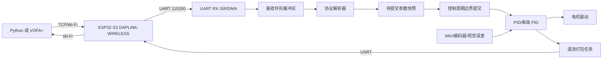

# 无线实时智能调参系统设计书

## 1. 文档信息

| 项目 | 内容 |
|---|---|
| 文档状态 | 可执行设计基线 |
| 目标系统 | STM32H0（当前实机）；协议可移植到 STM32 F1/G4 或 TI MSPM0G3507 |
| 无线模块 | Horco DAPLINK-WIRELESS / ESP32-S3，提供无线 SWD 与 UART 透传 |
| 主控制周期 | 5 ms（200 Hz） |
| 遥测周期 | 20 ms（50 Hz，允许按需降频） |
| UART 默认配置 | 115200 baud，8 data bits，1 stop bit，无校验 |
| 下行帧长度 | 18 bytes |
| 上行帧长度 | 20 bytes |
| 当前仓库基线 | 树莓派视觉控制脚本与 JY61P C 驱动，尚无 MCU 协议实现 |

本文档是固件、上位机和联调人员共同使用的实现契约。除特别说明外，所有多字节整数和 IEEE 754 `float` 均采用小端序。

## 2. 目标与范围

### 2.1 目标

1. 允许电脑端在线修改一个或多个控制环的 PID 参数。
2. 无线链路的接收、解析和遥测不得阻塞 5 ms 主控制周期。
3. 参数只有在完整帧、校验、范围和浮点合法性全部通过后才可生效。
4. 支持单环 PID、PI、PD 和平衡车串级控制。
5. 支持误差遥测、控制输出遥测、参数版本确认和故障状态显示。

### 2.2 范围

本设计覆盖：

- MCU 端 UART 接收、协议解析、参数提交和遥测发送；
- PID 参数存储、串级控制接口和安全限幅；
- ESP32-S3 无线透传链路的接口约束；
- Python/VOFA+ 上位机联调流程；
- 单元测试、台架测试和整车验收标准。

本设计不绑定具体电机驱动、编码器、IMU、视觉算法或 DAPLINK-WIRELESS 的私有网络配置。硬件差异通过适配层处理。

## 3. 现有工程基线

当前仓库已经存在以下可复用内容：

- [jy61p_attitude.c](/E:/嵌入式/electronic-design/jy61p_attitude.c) 和 [jy61p_attitude.h](/E:/嵌入式/electronic-design/jy61p_attitude.h)：C99 JY61P UART 驱动；
- [树莓派_1.py](/E:/嵌入式/electronic-design/树莓派_1.py)：树莓派视觉控制和 Emm42 串口控制，包含约 5 ms 控制循环与 PID 参数；
- [4_optimized.py](/E:/嵌入式/electronic-design/4_optimized.py)、[7.py](/E:/嵌入式/electronic-design/7.py)：MaixCAM/电机控制实验脚本。

当前没有 STM32H0 工程、DAPLINK-WIRELESS 透传适配层或本设计的 18 字节协议实现。后续实施应新建独立 MCU 模块，不修改 JY61P 驱动的帧格式。

## 4. 系统架构



### 4.1 任务边界

| 模块 | 执行上下文 | 允许操作 | 禁止操作 |
|---|---|---|---|
| UART RX ISR | 中断 | 读取字节、写环形缓冲区、置位事件 | 浮点运算、复杂解析、阻塞发送 |
| 协议解析器 | 主循环或低优先级任务 | 状态机解析、校验、范围检查 | 直接修改正在运行的 PID 快照 |
| 参数提交 | 5 ms 控制周期开始处 | 一次性替换完整 PID 快照 | 部分字段更新 |
| PID 控制 | 5 ms/20 ms 控制任务 | 读取只读快照并计算输出 | 等待无线数据 |
| 遥测发送 | 20 ms 调度任务 | 读取状态、入发送队列 | 阻塞主控制周期 |

### 4.2 数据一致性

参数采用双缓冲：

1. 解析器写入 `pending_config`。
2. 校验全部通过后设置 `pending_valid=1`。
3. 控制周期开始时，在临界区内将 `pending_config` 整体复制到 `active_config`。
4. 复制完成后递增 `revision`，遥测帧回传该版本号。

禁止在控制计算过程中逐字段写入 `kp`、`ki`、`kd`。32 位对齐写入在常见 Cortex-M 上通常是原子的，但本设计不依赖这种实现细节。

## 5. 控制环定义

| `Loop_ID` | 控制环 | 默认算法 | `aux` 定义 |
|---:|---|---|---|
| `0x01` | 角度环 | PD/PID | 目标角度，单位 `0.01 deg` |
| `0x02` | 速度环 | PI/PID | 目标速度，单位由应用定义，默认 `rpm` |
| `0x03` | 位置环 | PI/PID | 目标位置低 16 位，单位编码器计数 |
| `0x04` | 循迹转向环 | PD | 基础速度，单位 `0.1%` PWM，建议范围 `-1000..1000` |

说明：`ki=0` 表示 PD，`kd=0` 表示 PI。控制器不根据 `Loop_ID` 猜测算法，而是由应用配置该环的积分和微分开关。

### 5.1 PID 计算约束

推荐计算形式：

```text
error = setpoint - measurement
P = kp * error
D = -kd * low_pass(d(measurement) / dt)
I_next = clamp(I + ki * error * dt, integral_min, integral_max)
output = clamp(P + I_next + D, output_min, output_max)
```

必须实现：

- 积分限幅；
- 输出限幅；
- 输出饱和时的条件积分或反算抗饱和；
- 微分对测量值计算，避免目标值突变造成微分冲击；
- `dt` 使用实测周期或固定周期，不得由无线报文时间决定；
- 传感器无效时关闭积分，并进入应用定义的安全输出。

### 5.2 串级平衡车

```text
速度误差 -> 速度 PI（20 ms） -> 角度目标限幅 -> 角度 PD（5 ms） -> 电机 PWM
```

建议顺序：

1. 关闭速度环，只调角度环 `kp`，确认车体能快速响应；
2. 增加角度环 `kd`，消除高频振荡；
3. 限制角度环输出和目标角度；
4. 启用速度环 `kp`；
5. 最后增加速度环 `ki`，消除长期位置偏差。

速度环输出必须经过角度目标限幅，避免外环瞬间要求不可实现的倾角。

### 5.3 视觉循迹车

```text
视觉偏差 -> 转向 PD -> 左右轮差速
基础速度（aux） -----------------> 左右轮共同速度
```

循迹环默认 `ki=0`。基础速度必须经过电机输出限幅，视觉丢失超过 `LOST_STOP_MS` 后停止或进入预定义的低速搜索状态。

## 6. 下行调参协议

### 6.1 固定帧格式

| 字节 | 字段 | 类型 | 说明 |
|---:|---|---|---|
| `0` | `HEAD1` | `uint8_t` | 固定 `0xAA` |
| `1` | `HEAD2` | `uint8_t` | 固定 `0xFF` |
| `2` | `Loop_ID` | `uint8_t` | `0x01..0x04` |
| `3..6` | `kp` | `float` | IEEE 754，小端 |
| `7..10` | `ki` | `float` | IEEE 754，小端 |
| `11..14` | `kd` | `float` | IEEE 754，小端 |
| `15..16` | `aux` | `int16_t` | 按控制环定义 |
| `17` | `checksum` | `uint8_t` | `sum(frame[0..16]) & 0xFF` |

帧长度固定为 18 bytes。`0x55` 不再作为帧尾使用，以避免“固定帧尾”和“累加和校验”语义冲突。

### 6.2 参数提交规则

收到完整帧后依次检查：

1. 帧头正确；
2. `Loop_ID` 在允许范围内；
3. 累加和正确；
4. `kp`、`ki`、`kd` 均为有限浮点数，不得为 `NaN` 或无穷大；
5. 参数满足该控制环的工程上下限；
6. `aux` 满足该控制环的范围；
7. 通过后写入待提交快照，并等待下一个控制周期原子提交。

任何一步失败都不得改变当前生效参数，并将错误状态置入下一帧遥测。

### 6.3 接收状态机

```text
WAIT_HEAD1
  0xAA -> WAIT_HEAD2
WAIT_HEAD2
  0xFF -> COLLECT
  0xAA -> WAIT_HEAD2
  other -> WAIT_HEAD1
COLLECT
  收集剩余 16 bytes
  长度满足 -> 校验 -> 提交或丢弃
```

解析器必须支持：任意字节噪声、半帧、连续帧、校验错误后重新同步，以及帧头出现在数据区的情况。

## 7. 上行遥测协议

### 7.1 固定帧格式

| 字节 | 字段 | 类型 | 说明 |
|---:|---|---|---|
| `0` | `HEAD1` | `uint8_t` | 固定 `0xAA` |
| `1` | `HEAD2` | `uint8_t` | 固定 `0xFE` |
| `2` | `Loop_ID` | `uint8_t` | 被报告的控制环 |
| `3` | `sequence` | `uint8_t` | 遥测序号，溢出回零 |
| `4..7` | `error` | `float` | 当前误差 |
| `8..11` | `output` | `float` | 控制器输出 |
| `12..15` | `measurement` | `float` | 当前测量值 |
| `16..17` | `revision` | `uint16_t` | 当前生效参数版本 |
| `18` | `status` | `uint8_t` | 状态位 |
| `19` | `checksum` | `uint8_t` | `sum(frame[0..18]) & 0xFF` |

状态位定义：

| 位 | 含义 |
|---:|---|
| `0` | 当前参数有效 |
| `1` | 控制器已使能 |
| `2` | 传感器数据有效 |
| `3` | 参数帧曾被拒绝 |
| `4` | 输出发生饱和 |
| `5` | 传感器数据超时 |
| `6..7` | 保留，发送为 0 |

遥测周期默认 20 ms。多环系统可按环轮询发送，或根据上位机选择只发送当前调试环。

## 8. 无线与电气接口

### 8.1 串口接线

```text
无线模块 TX  -> MCU UART_RX
无线模块 RX  <- MCU UART_TX
无线模块 GND --- MCU GND
无线模块 IO 电源 -> 按模块规格提供 3.3 V
```

TX/RX 必须交叉连接。不能将 RS-232 或 RS-485 电平直接连接到 MCU 3.3 V TTL UART。DAPLINK-WIRELESS 的 UART 电压、默认波特率、TCP 监听/连接方向和虚拟串口模式必须以实际模块手册及现场抓包结果为准。

### 8.2 链路约束

- 无线链路只传输参数和遥测，不承担 5 ms 控制闭环的实时触发；
- 参数链路丢包时继续运行最近一次有效参数；
- 收到非法或超范围参数时保持旧参数；
- 如果应用包含“远程使能/停止”，必须另设明确的控制命令和本地急停优先级，不得用 PID 参数帧隐式实现。

## 9. 推荐固件目录与接口

建议在 STM32/TI 工程中新增以下模块：

```text
Core/
  Inc/
    tune_protocol.h
    pid_controller.h
    telemetry.h
    control_config.h
  Src/
    tune_protocol.c
    pid_controller.c
    telemetry.c
    control_app.c
```

建议接口：

```c
void TuneProtocol_Init(TuneProtocol *ctx);
void TuneProtocol_InputByte(TuneProtocol *ctx, uint8_t byte);
void TuneProtocol_Poll(TuneProtocol *ctx, uint32_t now_ms);
bool TuneProtocol_TakePending(TuneProtocol *ctx, TuneConfig *out);
uint16_t TuneProtocol_GetRevision(const TuneProtocol *ctx, uint8_t loop_id);
```

UART 接收中断只调用 `TuneProtocol_InputByte` 或将字节写入环形缓冲区。若使用 DMA，采用 DMA 空闲线/半传输事件搬运数据，协议状态机仍在非中断上下文运行。

控制周期伪代码：

```c
void Control_5ms(void)
{
    TuneProtocol_CommitAtControlBoundary(&tune);

    Sensor_Update();
    if (!Sensor_IsValid()) {
        PID_ResetIntegral(&angle_pid);
        Motor_SetSafeOutput();
        return;
    }

    PID_Snapshot angle = TuneProtocol_GetActive(&tune, LOOP_ANGLE);
    PID_Snapshot speed = TuneProtocol_GetActive(&tune, LOOP_SPEED);
    Control_RunCascade(&angle, &speed, 0.005f);
}
```

## 10. 上位机实现要求

上位机可使用 Python 或 VOFA+：

- P/I/D 控件必须绑定 `Loop_ID`；
- 发送前用 `struct.pack('<BB B f f f h', ...)` 打包数据，再追加校验；
- 读取上行帧后校验并按 `Loop_ID` 分流；
- 只有看到 `revision` 变化，才显示“参数已生效”；
- 参数值必须在 UI 层先做范围限制；
- 变步长只影响 UI 的调节增量，不改变 MCU 的控制周期。

推荐变步长规则：

| 条件 | 步长 |
|---|---:|
| `abs(error) > 20` | `1.0` |
| `5 <= abs(error) <= 20` | `0.2` |
| `abs(error) < 5` | `0.05` |

该规则应作为上位机辅助功能，不能替代 MCU 内部的积分限幅、输出限幅和失效保护。

## 11. 智能调参策略

### 11.1 上位机变步长

上位机根据最近有效遥测帧的误差自动选择步长。参数改变后等待至少一个遥测周期，再根据 `revision` 和误差变化判断下一步，不允许在没有新遥测数据时连续高速发送。

### 11.2 MCU 非线性控制

如确有大误差快速恢复需求，采用显式配置的分段增益：

```text
if abs(error) > large_error_threshold:
    kp_effective = kp * large_error_gain
    integral = 0
else:
    kp_effective = kp
```

分段阈值、增益、输出限幅和积分清零行为必须可记录、可复现。平衡车等高动态系统不建议直接使用无条件 Bang-Bang 输出，优先采用限幅的非线性比例项。

## 12. 故障处理与安全策略

| 故障 | 检测 | 处理 |
|---|---|---|
| UART 噪声/半帧 | 状态机超时或校验失败 | 丢弃当前帧并重新同步 |
| 参数非法 | ID、浮点、范围检查失败 | 保持旧参数，设置拒绝标志 |
| 无线断开 | 只影响参数/遥测链路 | 控制器继续使用最近有效参数 |
| 传感器超时 | 超过传感器有效窗口 | 清零积分并输出安全值 |
| 电机输出饱和 | 输出达到上下限 | 条件积分或反算抗饱和 |
| MCU 看门狗复位 | 独立看门狗触发 | 上电使用编译期默认参数，禁止自动恢复危险输出 |
| 参数掉电 | 参数未持久化 | 重新上电恢复默认参数，运行时调参不自动写 Flash |

默认情况下不把每次调参写入 Flash，以避免频繁擦写和运行时阻塞。需要持久化时，另设低频保存命令、版本校验和双页掉电保护。

## 13. 实施步骤

### 阶段 A：协议与算法离线验证

1. 创建 `tune_protocol.c/.h` 和 `pid_controller.c/.h`。
2. 编写主机端帧生成器和 C99 单元测试。
3. 使用随机噪声、拆包、粘包和非法浮点输入测试状态机。
4. 验证所有非法帧不会改变 `active_config`。

### 阶段 B：MCU 接入

1. 在 CubeMX/SysConfig 中配置 UART 115200、8N1。
2. 配置 RX 中断或 DMA 空闲线接收。
3. 接入环形缓冲区和协议解析任务。
4. 在 5 ms 控制周期边界提交参数快照。
5. 每 20 ms 生成并发送一帧遥测。
6. 用逻辑分析仪确认 UART 电平、波特率、帧长度和帧间隔。

### 阶段 C：无线联调

1. 先使用 USB-TTL 直连 MCU，排除无线模块变量。
2. 发送固定合法帧，确认 `revision` 增加且 PID 参数变化。
3. 发送错误校验帧和超范围帧，确认参数不变。
4. 接入 DAPLINK-WIRELESS，确认 TCP/虚拟串口方向和丢包行为。
5. 连接 VOFA+ 或 Python 工具，观察误差、输出、测量值和状态位。

### 阶段 D：整车调参

1. 电机悬空，验证输出方向、限幅和急停。
2. 平衡车先调角度环，再调速度环。
3. 循迹车先用低基础速度调 PD，再逐步增加 `aux` 基础速度。
4. 进行无线断开、传感器拔出、非法参数和复位测试。

## 14. 验收标准

### 14.1 协议验收

- 合法 18 字节下行帧在一个控制周期内或下一个控制周期边界生效；
- 任何校验错误、非法 ID、`NaN`、无穷大或越界参数均不改变活动参数；
- 连续帧、半帧和噪声流均能重新同步；
- 上行 20 字节帧可被主机正确解析；
- `revision` 仅在参数成功提交后递增。

### 14.2 实时性验收

- UART RX ISR 不执行浮点运算、不阻塞、不调用发送函数；
- 无线断开或上位机停止发送不改变 5 ms 控制周期调度；
- 控制周期不等待 UART、Wi-Fi 或文件系统；
- 以 GPIO 翻转或 DWT 计时验证控制周期抖动满足目标板要求，目标值由具体电机和传感器方案确定。

### 14.3 安全验收

- 传感器超时后能在规定时间内进入安全输出；
- 输出限幅、积分限幅和急停逻辑在全量程有效；
- 复位后只加载安全默认参数；
- 断开无线链路后车辆不会因协议异常产生额外输出。

### 14.4 调参验收

- 上位机可以分别修改角度环、速度环、位置环和循迹环；
- 参数生效状态以 `revision` 为准，而不是以上位机发送成功为准；
- 误差、测量值、输出和状态位能实时绘图；
- 变步长调节在大误差和小误差区间符合配置。

## 15. 待确认事项

以下事项在烧录和整车测试前必须由硬件资料或实测确认：

1. DAPLINK-WIRELESS 的实际 UART 电平、默认串口参数和网络连接模式；
2. STM32 或 MSPM0 的具体型号、时钟频率、UART 实例和中断优先级；
3. 角度、速度、位置和循迹环的参数上下限；
4. 编码器速度单位、位置计数范围和溢出处理方式；
5. 电机驱动器的 PWM 方向、死区、最大输出和失速保护；
6. IMU/视觉数据有效超时以及传感器失效后的车辆安全动作；
7. 是否需要远程使能、停止或恢复默认参数命令。

未确认的硬件参数不得写成固件常量。应放入 `control_config.h` 或板级配置文件，并在烧录版本中记录。

## 16. 交付物清单

```text
docs/
  无线实时智能调参系统设计书.md
firmware/
  tune_protocol.c
  tune_protocol.h
  pid_controller.c
  pid_controller.h
  telemetry.c
  telemetry.h
host/
  tune_console.py
  protocol.py
tests/
  test_tune_protocol.c
  test_protocol.py
```

本设计书完成后，下一步应先交付协议解析器和离线测试，再进行具体 MCU 外设接入。这样可以把协议错误、控制算法错误和无线链路错误分开定位。
